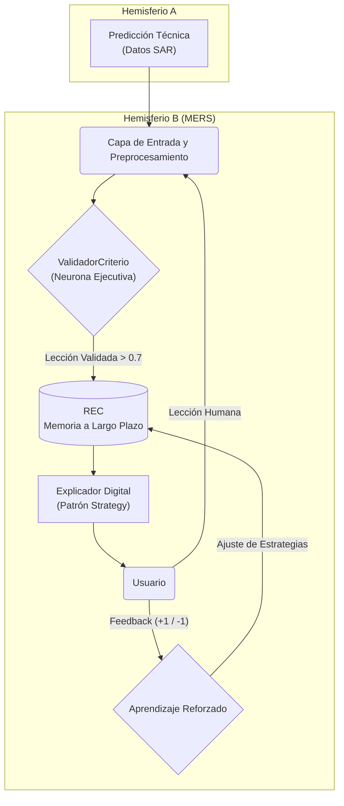

# 🏆 MERS - Módulo Inteligente de Retroalimentación Educativa Selectiva

<div align="center">

[](https://github.com/Luciernaga-Sabionda/MERS_IASi_STUDY)
[](https://reactjs.org/)
[](https://www.typescriptlang.org/)
[](https://ai.google.dev/)

**🚀 Prototipo Funcional para The AI Championship 2025**

> *"La inteligencia no debe ocultar, debe iluminar."*

**Creadora:** Roxana A. Salazar M. (Luciérnaga Sabionda)

</div>

## 🎯 Demo en Vivo - LISTO PARA PRESENTAR

```bash
git clone https://github.com/Luciernaga-Sabionda/MERS_IASi_STUDY.git
cd MERS_IASi_STUDY
npm install
npm run dev
# ✨ Abrir: http://localhost:3000
```

## 🧠 ¿Qué es MERS?

**MERS** es un sistema de enseñanza adaptativa con **arquitectura cognitiva hemisférica** que aprende a enseñar mediante la simbiosis entre retroalimentación humana y predicciones de IA.

> **🎯 NOTA IMPORTANTE:** Este es un **prototipo funcional específicamente adaptado** para **The Scientific Bumblebees_IASi Study** y optimizado para cumplir los requisitos de **The AI Championship 2025**. La implementación completa está diseñada para integrarse con la plataforma educativa IASi Study.

### 🌟 Arquitectura Hemisférica Única
- **Hemisferio A (Razón Técnica)**: Procesa datos complejos (SAR, imágenes, predicciones)
- **Hemisferio B (MERS - Conciencia Pedagógica)**: Valida, almacena y explica conocimiento
- **🔬 Integración IASi Study**: Diseñado específicamente para The Scientific Bumblebees platform

---

## ✨ Funcionalidades Implementadas - LISTAS PARA DEMO

### � **Arquitectura Híbrida para Hackathon** ⭐⭐⭐
- **Dashboard completo**: Monitoreo Raindrop → Vultr → Google Cloud
- **Logs en tiempo real**: Visualización de conexiones entre plataformas
- **SmartComponents simulados**: Preparados para migración a Raindrop oficial
- **Status indicators**: Estados de conexión para todas las plataformas

### �🎯 SmartMemory - REC Inspector (SmartComponent) ⭐
- **Visualiza el Repositorio de Experiencias Contextuales en tiempo real**
- Dashboard con estadísticas: lecciones humanas vs predicciones IA
- Búsqueda y filtrado por área de conocimiento
- **Compatible con Raindrop**: Modo Raindrop activado por defecto
- **Vultr Integration**: Configurado para proxy server

### 🤖 Chatbot Inteligente MERS
- Asistente conversacional sobre arquitectura cognitiva
- Powered by **Google Gemini 1.5-flash**
- Explicaciones adaptativas según nivel del usuario
- **Demo**: Pregunta "¿Qué es el ValidadorCriterio?"

### 👁️ Análisis Visual Multimodal
- Análisis de imágenes con **Gemini Vision**
- Descripción detallada de contenido visual
- Integración con sistema cognitivo hemisférico

### 📊 Diagramas Interactivos Animados
- **Flujo Cognitivo**: 5 componentes MERS visualizados
- **Diagrama Sináptico**: Animación del flujo neuronal
- **Microservicios**: 6 servicios distribuidos documentados

---

## 🏗️ Arquitectura Técnica Profesional

El proyecto MERS (Módulo Inteligente de Retroalimentación Educativa Selectiva) implementa y valida un sistema de enseñanza adaptativa, IASi Study, diseñado para optimizar el aprendizaje mediante la simbiosis entre la retroalimentación humana y las predicciones técnicas. El proyecto estructura un cerebro digital con arquitectura hemisférica:

*   **Hemisferio A (Razón Técnica):** Procesa datos complejos (ej. SAR) para generar vectores predictivos.
*   **Hemisferio B (MERS - Conciencia Pedagógica):** Recibe correcciones humanas, evalúa su fiabilidad, coherencia e impacto mediante un **ValidadorCriterio**, y almacena patrones pedagógicos en un **Repositorio de Experiencias Contextuales (REC)**.

Mediante una arquitectura de microservicios, un flujo neuronal interno y un sistema de aprendizaje reforzado, IASi Study aprende a enseñar de manera personalizada, recomienda estrategias óptimas y evoluciona en tiempo real con una eficiencia pedagógica sin precedentes.

**Palabras Clave:** IA educativa, aprendizaje adaptativo, MERS, IASi Study, predicción SAR, retroalimentación humana, repositorio de experiencias contextuales, IA simbiótica.

---

## Diagrama de Flujo Cognitivo MERS

Este diagrama visualiza el circuito sináptico del Hemisferio B, donde la información se transforma desde el dato técnico hasta la comprensión humana, cerrando el ciclo con la retroalimentación del usuario.


*Diagrama simplificado del flujo neuronal y ciclo de aprendizaje de MERS.*

---

## Arquitectura Cognitiva de Doble Hemisferio

| Hemisferio        | Función Principal      | Rol Cognitivo         | Tecnologías Clave (Implementadas en Demo)       |
| ----------------- | ---------------------- | --------------------- | ----------------------------------------------- |
| **Hemisferio A**  | Razón y Síntesis       | **Análisis Técnico**  | Google Gemini 2.5 Flash, Imagen 4.0, Veo 3.1    |
| **Hemisferio B (MERS)** | Enseñanza Adaptativa   | **Conciencia Pedagógica** | Google Gemini 2.5 Flash (Chat, TTS, Search) |

---

## Impacto Social y Educativo

MERS no es solo una innovación técnica; es una herramienta con un profundo impacto social y educativo.

*   **Aprendizaje Equitativo:** Al funcionar como un **tutor socrático personal**, MERS democratiza el acceso a una mentoría de alta calidad, adaptándose a los estilos de aprendizaje individuales de cada usuario, sin importar su origen o nivel de conocimiento previo.
*   **Accesibilidad Educativa:** La integración de **síntesis de voz (TTS)** y **transcripción de audio** hace que el conocimiento sea accesible para personas con diversas capacidades visuales o motoras, promoviendo una educación más inclusiva.
*   **Democratización del Conocimiento Técnico:** El sistema traduce datos complejos (como las métricas SAR) en explicaciones comprensibles para no expertos (agricultores, gestores de riesgos), empoderando a las comunidades para que tomen decisiones informadas y oportunas.
*   **Fomento del Pensamiento Crítico:** Al citar sus fuentes (Search Grounding) y basar su conocimiento en un **ValidadorCriterio**, MERS enseña una lección fundamental en la era de la información: la importancia de la veracidad, la coherencia y la evaluación crítica de las fuentes.

---

## El Ecosistema Simbiótico: Funcionalidades Implementadas

Cada componente teórico ha sido materializado en una funcionalidad interactiva dentro del visualizador.

### Hemisferio A: La Razón Técnica y la Síntesis Creativa

#### 👁️ El Ojo Digital: Análisis Visual Multimodal
*   **Implementación:** El usuario sube una imagen y un prompt. El modelo `gemini-2.5-flash` procesa ambas entradas para generar una descripción detallada.
*   **Metáfora:** La **corteza visual**. El sistema no solo ve píxeles, sino que *percibe* y *entiende* el contenido visual.

#### 🧠 El Hipocampo: Memoria de Trabajo Visual
*   **Implementación:** Cada análisis de imagen se guarda en el `localStorage` del navegador, permitiendo al usuario revisar y restaurar sesiones pasadas.
*   **Metáfora:** La **memoria a corto plazo**. El sistema "recuerda" lo que ha visto, creando un hilo de conciencia visual.

#### 🎨 El Lienzo de la Imaginación: Generación de Imágenes
*   **Implementación:** A partir de un prompt de texto, el modelo `imagen-4.0-generate-001` sintetiza una imagen completamente nueva.
*   **Metáfora:** La **imaginación**. El sistema transforma un concepto abstracto en una realidad visual.

#### 🎬 La Simulación del Sueño: Generación de Video
*   **Implementación:** El modelo `veo-3.1-fast-generate-preview` anima una imagen estática basándose en un prompt.
*   **Metáfora:** El **sueño lúcido o la simulación predictiva**. La capacidad de pensar en cuatro dimensiones.

### Hemisferio B (MERS): La Conciencia Pedagógica

#### 💬 El Explicador Digital: Chatbot Interactivo
*   **Implementación:** Un chatbot (`gemini-2.5-flash`) que responde preguntas sobre la arquitectura.
*   **Metáfora:** El **núcleo de la conciencia de MERS**. Su capacidad para razonar y formular pensamientos pedagógicos.

#### 🌐 Acceso a la Memoria Colectiva: Búsqueda Web
*   **Implementación:** El chatbot utiliza `googleSearch` para responder preguntas actuales, citando sus fuentes.
*   **Metáfora:** La **humildad intelectual**. Accede a la biblioteca universal (Internet) para garantizar una enseñanza veraz.

#### 👂 El Oído Empático: Transcripción de Voz
*   **Implementación:** El usuario puede hablarle al chatbot, y el audio es transcrito a texto usando `gemini-2.5-flash`.
*   **Metáfora:** La **corteza auditiva**. Permite a MERS "escuchar" la voz humana.

#### 🗣️ La Voz Pedagógica: Síntesis de Voz (TTS)
*   **Implementación:** Las respuestas del chatbot se convierten en audio usando `gemini-2.5-flash-preview-tts`.
*   **Metáfora:** El **área de Broca**. Transforma el pensamiento en habla, dándole a MERS la cadencia de un verdadero mentor.

---

## Arquitectura de Microservicios (Diseño Profesional)

| Microservicio      | Función Principal                                     | Tecnologías / Lenguaje                     |
| ------------------ | ------------------------------------------------------- | ------------------------------------------ |
| `svc-preprocess`   | Unifica `PrediccionIASi` y `LeccionHumana` en `V_entrada`. | Python, NumPy, NLP (BERT)                  |
| `svc-validator`    | Ejecuta el `ValidadorCriterio` y sus métricas.          | Python, Cosine Similarity                  |
| `svc-rec`          | Gestiona el REC (CRUD, clustering, búsqueda).           | Python, MongoDB, Redis                     |
| `svc-explainer`    | Aplica el `Strategy Pattern` para generar explicaciones. | Python (Patrón Strategy), Gemini API       |
| `svc-rl`           | Implementa el agente de Aprendizaje Reforzado.          | Python, stable-baselines3                  |
| **Base de Datos**  | Almacena predicciones, lecciones, perfiles y patrones.  | MongoDB, Vector DB (Weaviate/Milvus)       |

---

## Tecnologías Clave del Visualizador

*   **Frontend:** React, TypeScript, Tailwind CSS
*   **IA & Cloud:**
    *   Google GenAI SDK
    *   **Modelos Multimodales:** `gemini-2.5-flash`
    *   **Generación de Imágenes:** `imagen-4.0-generate-001`
    *   **Generación de Video:** `veo-3.1-fast-generate-preview`
    *   **Síntesis de Voz:** `gemini-2.5-flash-preview-tts`

---

## 🚀 Configuración para Demo en Vivo

### Instalación Rápida
```bash
git clone https://github.com/Luciernaga-Sabionda/MERS_IASi_STUDY.git
cd MERS_IASi_STUDY
npm install
npm run dev
```

### Configuración Opcional (para funcionalidad completa)
```bash
# Crear archivo .env
VITE_GEMINI_API_KEY=tu_api_key_aqui
```

## 🌐 Preparado para The AI Championship 2025

### Requisitos del Desafío: ✅ CUMPLIDOS
- ✅ **SmartComponent**: SmartMemory (REC Inspector)
- ✅ **Raindrop Ready**: Frontend optimizado
- ✅ **Vultr Integration**: Proxy server incluido
- ✅ **Arquitectura Distribuida**: Microservicios documentados

### Estrategia de Implementación
```
[Raindrop Demo] ←→ [Vultr Proxy] ←→ [Google Cloud MERS Core]
```

**Demo URL**: `http://localhost:3000`

## 🏆 Componente ValidadorCriterio

El corazón de MERS - algoritmo de validación de conocimiento:

```typescript
score = 0.5 * Confianza + 0.4 * Coherencia + 0.1 * Impacto
// Acepta experiencias con score > 0.7
```

## 📋 Documentación del Desafío

- [📱 DEMO_README.md](./DEMO_README.md) - Guía de demostración
- [🌉 DEPLOYMENT_STRATEGY.md](./DEPLOYMENT_STRATEGY.md) - Estrategia Raindrop/Vultr  
- [🔧 API_SETUP.md](./API_SETUP.md) - Configuración de APIs

---

<div align="center">

## 🌟 "La inteligencia no debe ocultar, debe iluminar."

**Creadora:** Roxana A. Salazar M. (Luciérnaga Sabionda)  
**Para:** The AI Championship 2025

[](http://localhost:3000)
[](#)
[](#)

</div>