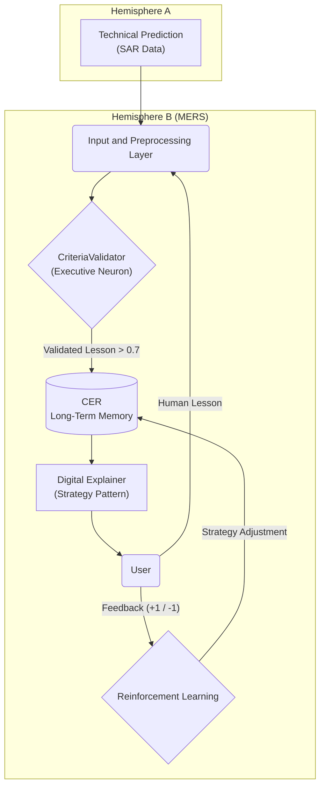

# 🏆 MERS - Selective Educational Feedback Intelligence Module

<div align="center">

[](https://github.com/Luciernaga-Sabionda/MERS_IASi_STUDY)
[](https://reactjs.org/)
[](https://www.typescriptlang.org/)
[](https://ai.google.dev/)

**🚀 Functional Prototype for The AI Championship 2025**

> *"Intelligence should not obscure, it should illuminate."*

**Creator:** Roxana A. Salazar M. (The Smart Firefly)

</div>

## 🚀 Installation and Configuration

### 1️⃣ Clone the Repository
```bash
git clone https://github.com/Luciernaga-Sabionda/MERS_IASi_STUDY.git
cd MERS_IASi_STUDY
npm install
```

### 2️⃣ Configure Google Gemini API Key

#### **📝 Get your API Key:**
1. Visit [Google AI Studio](https://aistudio.google.com/app/apikey)
2. Sign in with your Google account
3. Click "Create API Key"
4. Copy your key (starts with `AIza...`)

#### **⚙️ Configure in the Project:**
```bash
# Copy example file
cp .env.example .env

# Edit the .env file and replace:
# VITE_GEMINI_API_KEY=your_gemini_api_key_here
# with your real key:
VITE_GEMINI_API_KEY=AIzaSy... (your key here)
```

#### **🔐 File Location:**
The `.env` file must be in the **project root**:
```
MERS_IASi_STUDY/
├── .env          ← Here (your file with the real key)
├── .env.example  ← Template
├── package.json
├── src/
└── ...
```

### 3️⃣ Start the Application
```bash
npm start
# ✨ Frontend: http://localhost:5173
# 🔧 Backend: http://localhost:3002
```

### ⚠️ Troubleshooting

**Problem:** "Missing API Key" or "missingApiKey: true"
- ✅ Verify that the `.env` file exists in the root
- ✅ Verify that the variable is called `VITE_GEMINI_API_KEY`
- ✅ Restart the server after editing `.env`

**Problem:** "Invalid API Key"
- ✅ Verify that you copied the complete key (without spaces)
- ✅ Generate a new key at [AI Studio](https://aistudio.google.com/app/apikey)

**Problem:** Tailwind CSS doesn't load
- ✅ Run: `npm install @tailwindcss/vite`
- ✅ Restart the server

## 🧠 What is MERS?

**MERS** is an adaptive teaching system with **hemispheric cognitive architecture** that learns to teach through the symbiosis between human feedback and AI predictions.

> **🎯 IMPORTANT NOTE:** This is a **functional prototype specifically adapted** for **The Scientific Bumblebees_IASi Study** and optimized to meet the requirements of **The AI Championship 2025**. The complete implementation is designed to integrate with the IASi Study educational platform.

### 🌟 Unique Hemispheric Architecture
- **Hemisphere A (Technical Reason)**: Processes complex data (SAR, images, predictions)
- **Hemisphere B (MERS - Pedagogical Consciousness)**: Validates, stores and explains knowledge
- **🔬 IASi Study Integration**: Specifically designed for The Scientific Bumblebees platform

---

## ✨ Implemented Features - READY FOR DEMO

### 🏗️ **Hybrid Architecture for Hackathon** ⭐⭐⭐
- **Complete dashboard**: Monitoring Raindrop → Vultr → Google Cloud
- **Real-time logs**: Visualization of cross-platform connections
- **Simulated SmartComponents**: Ready for migration to official Raindrop
- **Status indicators**: Connection states for all platforms

### 📊 SmartMemory - CER Inspector (SmartComponent) ⭐
- **Visualizes the Contextual Experience Repository in real-time**
- Dashboard with statistics: human lessons vs AI predictions
- Search and filtering by knowledge area
- **Raindrop Compatible**: Raindrop mode enabled by default
- **Vultr Integration**: Configured for proxy server

### 🤖 MERS Intelligent Chatbot
- Conversational assistant about cognitive architecture
- Powered by **Google Gemini 1.5-flash**
- Adaptive explanations according to user level
- **Demo**: Ask "What is the CriteriaValidator?"

### 👁️ Multimodal Visual Analysis
- Image analysis with **Gemini Vision**
- Detailed description of visual content
- Integration with hemispheric cognitive system

### 📊 Animated Interactive Diagrams
- **Cognitive Flow**: 5 MERS components visualized
- **Synaptic Diagram**: Animation of neural flow
- **Microservices**: 6 distributed services documented

---

## 🏗️ Professional Technical Architecture

The MERS project (Selective Educational Feedback Intelligence Module) implements and validates an adaptive teaching system, IASi Study, designed to optimize learning through the symbiosis between human feedback and technical predictions. The project structures a digital brain with hemispheric architecture:

*   **Hemisphere A (Technical Reason):** Processes complex data (e.g. SAR) to generate predictive vectors.
*   **Hemisphere B (MERS - Pedagogical Consciousness):** Receives human corrections, evaluates their reliability, coherence and impact through a **CriteriaValidator**, and stores pedagogical patterns in a **Contextual Experience Repository (CER)**.

Through a microservices architecture, an internal neural flow and a reinforcement learning system, IASi Study learns to teach in a personalized way, recommends optimal strategies and evolves in real-time with unprecedented pedagogical efficiency.

**Keywords:** Educational AI, adaptive learning, MERS, IASi Study, SAR prediction, human feedback, contextual experience repository, symbiotic AI.

---

## MERS Cognitive Flow Diagram

This diagram visualizes the synaptic circuit of Hemisphere B, where information is transformed from technical data to human understanding, closing the loop with user feedback.


*Simplified diagram of MERS's neural flow and learning cycle.*

---

## Dual Hemisphere Cognitive Architecture

| Hemisphere        | Main Function      | Cognitive Role         | Key Technologies (Implemented in Demo)       |
| ----------------- | ------------------ | ---------------------- | ------------------------------------------- |
| **Hemisphere A**  | Reason and Synthesis | **Technical Analysis** | Google Gemini 2.5 Flash, Imagen 4.0, Veo 3.1 |
| **Hemisphere B (MERS)** | Adaptive Teaching | **Pedagogical Consciousness** | Google Gemini 2.5 Flash (Chat, TTS, Search) |

---

## Social and Educational Impact

MERS is not just a technical innovation; it is a tool with profound social and educational impact.

*   **Equitable Learning:** By functioning as a **personal Socratic tutor**, MERS democratizes access to high-quality mentorship, adapting to the individual learning styles of each user, regardless of their background or prior knowledge level.
*   **Educational Accessibility:** The integration of **text-to-speech (TTS)** and **audio transcription** makes knowledge accessible to people with diverse visual or motor abilities, promoting more inclusive education.
*   **Democratization of Technical Knowledge:** The system translates complex data (such as SAR metrics) into understandable explanations for non-experts (farmers, risk managers), empowering communities to make informed and timely decisions.
*   **Fostering Critical Thinking:** By citing its sources (Search Grounding) and basing its knowledge on a **CriteriaValidator**, MERS teaches a fundamental lesson in the information age: the importance of truthfulness, coherence, and critical evaluation of sources.

---

## The Symbiotic Ecosystem: Implemented Functionalities

Each theoretical component has been materialized into an interactive functionality within the visualizer.

### Hemisphere A: Technical Reason and Creative Synthesis

#### 👁️ The Digital Eye: Multimodal Visual Analysis
*   **Implementation:** The user uploads an image and a prompt. The `gemini-2.5-flash` model processes both inputs to generate a detailed description.
*   **Metaphor:** The **visual cortex**. The system doesn't just see pixels, but *perceives* and *understands* visual content.

#### 🧠 The Hippocampus: Visual Working Memory
*   **Implementation:** Each image analysis is saved to the browser's `localStorage`, allowing the user to review and restore past sessions.
*   **Metaphor:** **Short-term memory**. The system "remembers" what it has seen, creating a thread of visual consciousness.

#### 🎨 The Imagination Canvas: Image Generation
*   **Implementation:** From a text prompt, the `imagen-4.0-generate-001` model synthesizes a completely new image.
*   **Metaphor:** **Imagination**. The system transforms an abstract concept into visual reality.

#### 🎬 Dream Simulation: Video Generation
*   **Implementation:** The `veo-3.1-fast-generate-preview` model animates a static image based on a prompt.
*   **Metaphor:** **Lucid dreaming or predictive simulation**. The ability to think in four dimensions.

### Hemisphere B (MERS): Pedagogical Consciousness

#### 💬 The Digital Explainer: Interactive Chatbot
*   **Implementation:** A chatbot (`gemini-2.5-flash`) that answers questions about the architecture.
*   **Metaphor:** The **core of MERS consciousness**. Its ability to reason and formulate pedagogical thoughts.

#### 🌐 Access to Collective Memory: Web Search
*   **Implementation:** The chatbot uses `googleSearch` to answer current questions, citing its sources.
*   **Metaphor:** **Intellectual humility**. Accesses the universal library (Internet) to ensure truthful teaching.

#### 👂 The Empathic Ear: Voice Transcription
*   **Implementation:** The user can speak to the chatbot, and the audio is transcribed to text using `gemini-2.5-flash`.
*   **Metaphor:** The **auditory cortex**. Allows MERS to "hear" the human voice.

#### 🗣️ The Pedagogical Voice: Text-to-Speech (TTS)
*   **Implementation:** Chatbot responses are converted to audio using `gemini-2.5-flash-preview-tts`.
*   **Metaphor:** **Broca's area**. Transforms thought into speech, giving MERS the cadence of a true mentor.

---

## Microservices Architecture (Professional Design)

| Microservice      | Main Function                                     | Technologies / Language                     |
| ------------------ | ------------------------------------------------- | ------------------------------------------ |
| `svc-preprocess`   | Unifies `PredictionIASi` and `HumanLesson` into `V_input`. | Python, NumPy, NLP (BERT)                  |
| `svc-validator`    | Executes the `CriteriaValidator` and its metrics.  | Python, Cosine Similarity                  |
| `svc-rec`          | Manages the CER (CRUD, clustering, search).       | Python, MongoDB, Redis                     |
| `svc-explainer`    | Applies the `Strategy Pattern` to generate explanations. | Python (Strategy Pattern), Gemini API      |
| `svc-rl`           | Implements the Reinforcement Learning agent.      | Python, stable-baselines3                  |
| **Database**       | Stores predictions, lessons, profiles and patterns. | MongoDB, Vector DB (Weaviate/Milvus)       |

---

## Key Technologies of the Visualizer

*   **Frontend:** React, TypeScript, Tailwind CSS
*   **AI & Cloud:**
    *   Google GenAI SDK
    *   **Multimodal Models:** `gemini-2.5-flash`
    *   **Image Generation:** `imagen-4.0-generate-001`
    *   **Video Generation:** `veo-3.1-fast-generate-preview`
    *   **Text-to-Speech:** `gemini-2.5-flash-preview-tts`

---

## 🚀 Configuration for Live Demo

### Quick Installation
```bash
git clone https://github.com/Luciernaga-Sabionda/MERS_IASi_STUDY.git
cd MERS_IASi_STUDY
npm install
npm run dev
```

### Environment configuration (for full functionality)
```pwsh
# Option A: .env file
cp .env.example .env
# Edit .env and add your keys

# Option B: export in PowerShell session
$env:VITE_GEMINI_API_KEY = "<YOUR_GEMINI_API_KEY>"
$env:VITE_RAINDROP_API_KEY = "<YOUR_RAINDROP_API_KEY>"
```

### Startup
```pwsh
# UI only
npm run dev

# Backend only
npm run server

# Both
npm run start
```

Header states:
- Green: Proxy connected.
- Yellow: Proxy connected but missing `VITE_GEMINI_API_KEY`.
- Red: Proxy down (run `npm run server`).

## 🌐 Ready for The AI Championship 2025

### Challenge Requirements: ✅ COMPLETED
- ✅ **SmartComponent**: SmartMemory (CER Inspector)
- ✅ **Raindrop Ready**: Optimized frontend
- ✅ **Vultr Integration**: Proxy server included
- ✅ **Distributed Architecture**: Documented microservices

### Implementation Strategy
```
[Raindrop Demo] ←→ [Vultr Proxy] ←→ [Google Cloud MERS Core]
```

**Demo URL**: `http://localhost:3000`

## 🏆 CriteriaValidator Component

The heart of MERS - knowledge validation algorithm:

```typescript
score = 0.5 * Confidence + 0.4 * Coherence + 0.1 * Impact
// Accepts experiences with score > 0.7
```

## 📋 Challenge Documentation

- [📱 DEMO_README.md](./DEMO_README.md) - Demonstration guide
- [🌉 DEPLOYMENT_STRATEGY.md](./DEPLOYMENT_STRATEGY.md) - Raindrop/Vultr strategy  
- [🔧 API_SETUP.md](./API_SETUP.md) - API configuration

---

<div align="center">

## 🌟 "Intelligence should not obscure, it should illuminate."

**Creator:** Roxana A. Salazar M. (The Smart Firefly)  
**For:** The AI Championship 2025

[](http://localhost:3000)
[](#)
[](#)

</div>
